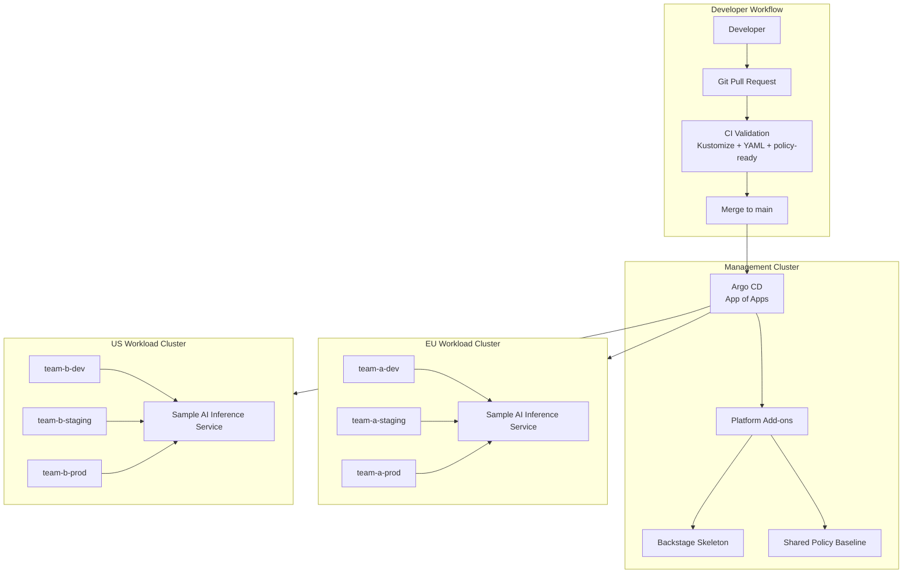

# Day 1 Architecture Diagram

```mermaid
flowchart TB

  subgraph Dev[Developer Workflow]
    A[Developer] --> B[Git Pull Request]
    B --> C[CI Validation\nKustomize + YAML + policy-ready]
    C --> D[Merge to main]
  end

  subgraph Mgmt[Management Cluster]
    E[Argo CD\nApp of Apps] --> F[Platform Add-ons]
    F --> G[Backstage Skeleton]
    F --> H[Shared Policy Baseline]
  end

  D --> E

  subgraph EU[EU Workload Cluster]
    EU1[team-a-dev]
    EU2[team-a-staging]
    EU3[team-a-prod]
    EU4[Sample AI Inference Service]
    EU1 --> EU4
    EU2 --> EU4
    EU3 --> EU4
  end

  subgraph US[US Workload Cluster]
    US1[team-b-dev]
    US2[team-b-staging]
    US3[team-b-prod]
    US4[Sample AI Inference Service]
    US1 --> US4
    US2 --> US4
    US3 --> US4
  end

  E --> EU
  E --> US
```
